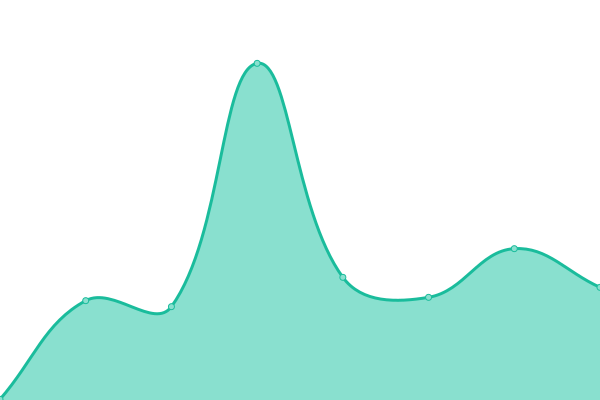

# [📈 Live Status](https://status.danishsite.me): <!--live status--> **🟧 Partial outage**

This repository contains the open-source uptime monitor and status page for [Danish Hakim](www.danishsite.me), powered by [Upptime](https://github.com/upptime/upptime).

With [Upptime](https://upptime.js.org), you can get your own unlimited and free uptime monitor and status page, powered entirely by a GitHub repository. We use [Issues](https://github.com/Jerit3787/status/issues) as incident reports, [Actions](https://github.com/Jerit3787/status/actions) as uptime monitors, and [Pages](https://status.danishsite.me) for the status page.

<!--start: status pages-->
<!-- This summary is generated by Upptime (https://github.com/upptime/upptime) -->
<!-- Do not edit this manually, your changes will be overwritten -->
<!-- prettier-ignore -->
| URL | Status | History | Response Time | Uptime |
| --- | ------ | ------- | ------------- | ------ |
|  [Main Website](https://www.danishplace.tech) | 🟥 Down | [main-website.yml](https://github.com/Jerit3787/status/commits/HEAD/history/main-website.yml) | 

 0ms
     
 | 

<a href="https://status.danishplace.tech/history/main-website">0.00%</a>
    

|  [API](https://www.danishsite.ml) | 🟥 Down | [api.yml](https://github.com/Jerit3787/status/commits/HEAD/history/api.yml) | 

 1741ms
     
 | 

<a href="https://status.danishplace.tech/history/api">75.45%</a>
    

|  [Web App Repository](https://app.danishplace.tech) | 🟥 Down | [web-app-repository.yml](https://github.com/Jerit3787/status/commits/HEAD/history/web-app-repository.yml) | 

 0ms
     
 | 

<a href="https://status.danishplace.tech/history/web-app-repository">0.00%</a>
    

|  [Projects Website](https://projects.danishplace.tech) | 🟥 Down | [projects-website.yml](https://github.com/Jerit3787/status/commits/HEAD/history/projects-website.yml) | 

 0ms
     
 | 

<a href="https://status.danishplace.tech/history/projects-website">0.00%</a>
    

|  [Links Website](https://links.danishplace.tech) | 🟩 Up | [links-website.yml](https://github.com/Jerit3787/status/commits/HEAD/history/links-website.yml) | 

 42ms
     
 | 

<a href="https://status.danishplace.tech/history/links-website">10.50%</a>
    

|  [Project Stutastic](https://stutastic.danishplace.tech) | 🟥 Down | [project-stutastic.yml](https://github.com/Jerit3787/status/commits/HEAD/history/project-stutastic.yml) | 

 0ms
     
 | 

<a href="https://status.danishplace.tech/history/project-stutastic">0.00%</a>
    

|  [Stutastic Planner](https://planner.danishplace.tech) | 🟥 Down | [stutastic-planner.yml](https://github.com/Jerit3787/status/commits/HEAD/history/stutastic-planner.yml) | 

 0ms
     
 | 

<a href="https://status.danishplace.tech/history/stutastic-planner">0.00%</a>
    

|  [Channel Buku Teks Website](https://www.channelbukuteks.ml) | 🟩 Up | [channel-buku-teks-website.yml](https://github.com/Jerit3787/status/commits/HEAD/history/channel-buku-teks-website.yml) | 

 609ms
     
 | 

<a href="https://status.danishplace.tech/history/channel-buku-teks-website">100.00%</a>
    

<!--end: status pages-->

[**Visit our status website →**](https://status.danishsite.me)

## 📄 License

- Powered by: [Upptime](https://github.com/upptime/upptime)
- Code: [MIT](./LICENSE) © [Danish Hakim](www.danishsite.me)
- Data in the `./history` directory: [Open Database License](https://opendatacommons.org/licenses/odbl/1-0/)
