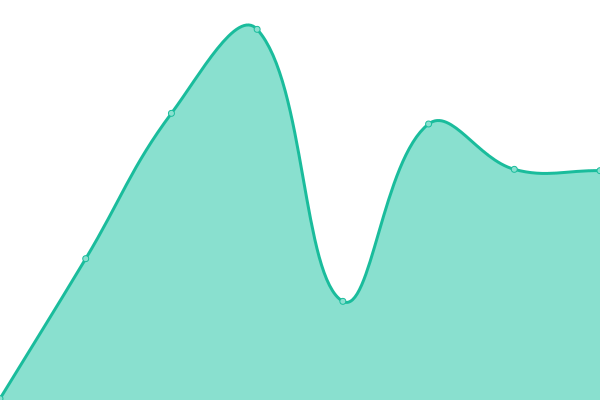

# [📈 Live Status](https://status.danplace.tech): <!--live status--> **🟩 All systems operational**

This repository contains the open-source uptime monitor and status page for [Danish Hakim](www.danishsite.me), powered by [Upptime](https://github.com/upptime/upptime).

With [Upptime](https://upptime.js.org), you can get your own unlimited and free uptime monitor and status page, powered entirely by a GitHub repository. We use [Issues](https://github.com/Jerit3787/status/issues) as incident reports, [Actions](https://github.com/Jerit3787/status/actions) as uptime monitors, and [Pages](https://status.danishsite.me) for the status page.

<!--start: status pages-->
<!-- This summary is generated by Upptime (https://github.com/upptime/upptime) -->
<!-- Do not edit this manually, your changes will be overwritten -->
<!-- prettier-ignore -->
| URL | Status | History | Response Time | Uptime |
| --- | ------ | ------- | ------------- | ------ |
|  [Main Website](https://www.danplace.tech) | 🟩 Up | [main-website.yml](https://github.com/Jerit3787/status/commits/HEAD/history/main-website.yml) | 

 95ms
     
 | 

<a href="https://status.danplace.tech/history/main-website">100.00%</a>
    

|  [API Server](https://api.danplace.tech/v3/status/check) | 🟩 Up | [api-server.yml](https://github.com/Jerit3787/status/commits/HEAD/history/api-server.yml) | 

 835ms
     
 | 

<a href="https://status.danplace.tech/history/api-server">100.00%</a>
    

|  [CDN Website](https://cdn.stutastic.danplace.tech) | 🟩 Up | [cdn-website.yml](https://github.com/Jerit3787/status/commits/HEAD/history/cdn-website.yml) | 

 139ms
     
 | 

<a href="https://status.danplace.tech/history/cdn-website">100.00%</a>
    

|  [Projects Website](https://projects.danplace.tech) | 🟩 Up | [projects-website.yml](https://github.com/Jerit3787/status/commits/HEAD/history/projects-website.yml) | 

 110ms
     
 | 

<a href="https://status.danplace.tech/history/projects-website">100.00%</a>
    

|  [Links Website](https://links.danplace.tech) | 🟩 Up | [links-website.yml](https://github.com/Jerit3787/status/commits/HEAD/history/links-website.yml) | 

 122ms
     
 | 

<a href="https://status.danplace.tech/history/links-website">100.00%</a>
    

|  [Social Links Website](https://personal.danplace.tech) | 🟩 Up | [social-links-website.yml](https://github.com/Jerit3787/status/commits/HEAD/history/social-links-website.yml) | 

 91ms
     
 | 

<a href="https://status.danplace.tech/history/social-links-website">100.00%</a>
    

|  [Project Stutastic](https://stutastic.danplace.tech) | 🟩 Up | [project-stutastic.yml](https://github.com/Jerit3787/status/commits/HEAD/history/project-stutastic.yml) | 

 120ms
     
 | 

<a href="https://status.danplace.tech/history/project-stutastic">100.00%</a>
    

|  [Tracking Website](https://tracking.danplace.tech) | 🟩 Up | [tracking-website.yml](https://github.com/Jerit3787/status/commits/HEAD/history/tracking-website.yml) | 

 948ms
     
 | 

<a href="https://status.danplace.tech/history/tracking-website">100.00%</a>
    

|  [Stutastic Planner](https://planner.danplace.tech) | 🟩 Up | [stutastic-planner.yml](https://github.com/Jerit3787/status/commits/HEAD/history/stutastic-planner.yml) | 

 93ms
     
 | 

<a href="https://status.danplace.tech/history/stutastic-planner">100.00%</a>
    

|  [Channel Buku Teks Website](https://bukuteks.github.io) | 🟩 Up | [channel-buku-teks-website.yml](https://github.com/Jerit3787/status/commits/HEAD/history/channel-buku-teks-website.yml) | 

 79ms
     
 | 

<a href="https://status.danplace.tech/history/channel-buku-teks-website">100.00%</a>
    

|  [Status Website](https://status.danplace.tech) | 🟩 Up | [status-website.yml](https://github.com/Jerit3787/status/commits/HEAD/history/status-website.yml) | 

 97ms
     
 | 

<a href="https://status.danplace.tech/history/status-website">100.00%</a>
    

<!--end: status pages-->

[**Visit our status website →**](https://status.danplace.tech)

## 📄 License

- Powered by: [Upptime](https://github.com/upptime/upptime)
- Code: [MIT](./LICENSE) © [Danish Hakim](www.danplace.tech)
- Data in the `./history` directory: [Open Database License](https://opendatacommons.org/licenses/odbl/1-0/)
